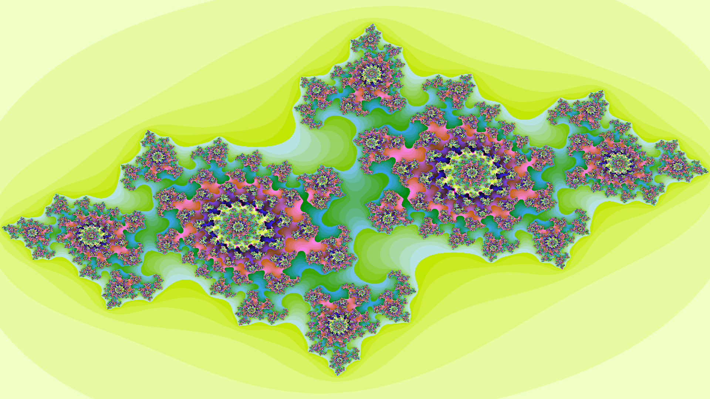
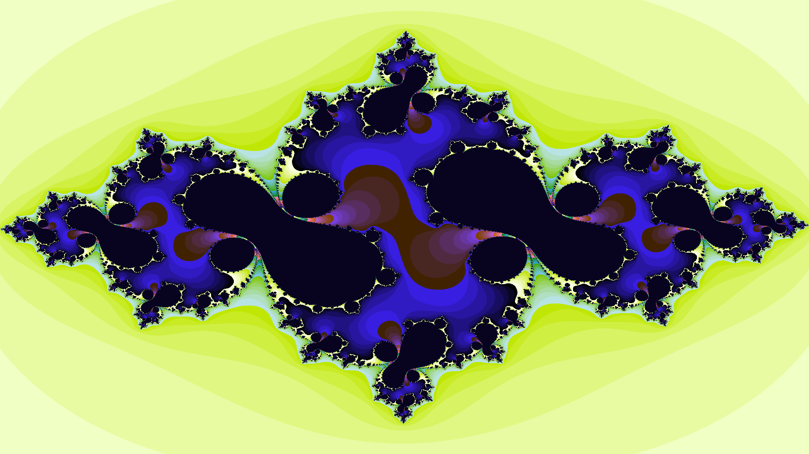

# Julia-set
## Exploring fractals in the Julia set

> The infinite! No other question has ever moved so profoundly the spirit of man.

David Hilbert

> ...the infinite sea of complexity includes two islands: one of Euclidean simplicity, and also a second of relative simplicity in which roughness is present, but is the same at all scales.

Benoît Mandelbrot, [2004](https://www.edge.org/conversation/benoit_mandelbrot-a-theory-of-roughness)


## Context
Various great sources exist that present the reader with an overview of the [Julia set](https://www.google.com/url?sa=t&rct=j&q=&esrc=s&source=web&cd=3&ved=2ahUKEwjtvNCWqpblAhXMITQIHUhtBKkQFjACegQICxAG&url=https%3A%2F%2Fen.wikipedia.org%2Fwiki%2FJulia_set&usg=AOvVaw1TkOuJzmcaF8RU5kldqgG_) and, more broadly, [fractals](https://en.wikipedia.org/wiki/Fractal). (I highly suggest reading [Julia Set Fractal (2D)](http://paulbourke.net/fractals/juliaset/) by Paul Bourke and [
Understanding Julia and Mandelbrot Sets](https://www.karlsims.com/julia.html) by Karl Sims.)

As such, only details regarding the code itself will be entertained in this document.

For each pixel of the image, the code performs a calculation and the pixels' color is a function of that calculation. That function is  which is performed recursively. Since both z and c are complex, we treat them as being composed of a real and imaginary component. The real component will be referred to with x and the imaginary component with y.



## Usage

**Gifs and images such as those displayed above can be rendered using the code.** Note: the code is used to render the images; other software must be used to make gifs, e.g. Adobe Photoshop.

The code is based on the following parameters:
- w: image width
- h: image height
- zoom: zoom level
- R: escape radius
- cX: constant along the x axis
- cY: constant along the y axis
- moveX: shift the image along the x axis
- moveY: shift the image along the y axis
- maxIter: maximum number of iterations
- filename: default filename is a description of the settings
- disp: display the fractal; default is False

All of these parameters have default values.

**The code can be run through *command line arguments* or by *custom function calls***.

### Command Line Arguments

For a quick demo, enter the following into the command line:
``` bash
$ python julia.py sample
```

Generally, a command line call should follow the following format:

``` bash
$ python julia.py cX cY filename
```

Here, cX and cY should be floats; filename will be typecast as a string. While laconic and lacking in parameters, adequate tuning of these two parameters will suffice to produce interesting results.

### Custom Function Calls

To render a series of images, a for-loop will be useful. To implement a custom loop, modifications can be made to the runtime() function.

``` python
def runtime():
    ...
    # Custom function calls
    for i in range(20):
        julia(cX=-0.8702+i/1000, filename=i, disp=False)
```

To run those custom function calls, simply execute the file without passing in any parameters:

``` bash
$ python julia.py
```

## Gallery / Examples

Some interesting ideas would be to vary the cX, cY, and/or zoom parameters to produce the effect of motion. Experiment with different values for each parameter to get a feel for what fractals can be rendered.

Below is a gallery of fractals produces with this code.

### Gifs


### Images



